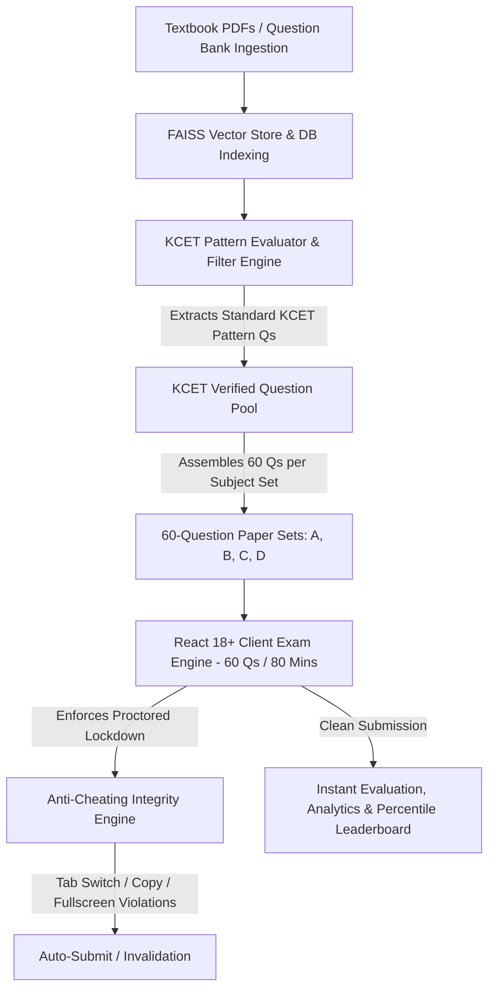

# 📄 Product Requirements Document (PRD)
## Mr.E — Official KCET Question Paper Generation & Exam Platform

**Document Status:** Approved & Active  
**Version:** 2.2.0  
**Target Audience:** Engineering & Development Team, Product Management, System Architects  
**Product Name:** Mr.E  
**Target Ecosystem:** Individuals involved in the KCET preparation and admission ecosystem including students, coaching institutions, and platform administrators  
**Frontend Framework:** React 18+ Single Page Application (SPA)  
**Backend Framework:** Flask (Python 3.10+) with Flask Blueprints  
**Last Updated:** August 2026  

---

## 1. 🎯 Executive Summary & Problem Statement

### 1.1 Executive Summary
**Mr.E** is a specialized, AI-driven exam preparation and question paper extraction platform designed for individuals involved in the KCET preparation and admission ecosystem including students, coaching institutions, and platform administrators. The platform ingests textbook content and question banks, applies an automated KCET Pattern Filter to extract standard KCET-level questions, and generates official-format exam paper sets containing **exactly 60 questions per set** (matching the official KCET 60-question/60-mark 80-minute paper structure).


The system features an integrated **Anti-Cheating & Exam Integrity Engine** and combines a modern **React 18+ Single Page Application (SPA)** frontend (built with **Vite**, **TypeScript/JavaScript**, **React Router v6**, and **Tailwind CSS**) with a robust **Flask (Python 3.10+)** REST API backend utilizing **Flask Blueprints**, **Flask-SQLAlchemy**, **RAG Retrieval**, **Groq LLMs**, and **FAISS Vector Search**.

### 1.2 Problem Statement
* **Non-Standard Question Counts & Patterns:** Existing online mock platforms present arbitrary question lengths (20, 50, or 100 questions) rather than adhering strictly to the official KCET 60-question format.
* **Unfiltered Question Banks:** Raw question banks contain out-of-syllabus, overly simple, or JEE-Advanced level questions that do not reflect actual KCET difficulty or chapter weightage.
* **Exam Malpractice & Cheating Vulnerabilities:** Online mock tests without proctoring suffer from tab-switching, copy-pasting, unauthorized search usage, and answer sharing among students.

---

## 2. 🚀 Product Vision & Core Workflow

### 2.1 Product Vision
To provide KCET aspirants and coaching institutions with an authentic, secure, automated exam platform that extracts standard KCET-pattern questions from indexed textbook banks and generates production-ready **60-question exam sets** with strict anti-cheating enforcement and instant analytics.

### 2.2 End-to-End Question Extraction & Exam Integrity Workflow



---

## 3. 👥 User Personas & Roles

| Persona / Role | Description & Needs | Primary Workflows |
| :--- | :--- | :--- |
| **KCET Student Aspirant** | Pre-University (PUC) student preparing specifically for KCET. | Takes 60-question proctored KCET timed subject papers, reviews step-by-step solutions, tracks KCET rank. |
| **Coaching Institute Admin** | Instructor or Director at a KCET coaching institute. | Generates custom question papers based on specific requirements (subject, topics, difficulty) and views student/class performance analytics. |
| **Platform Administrator** | Platform owner managing system health, platform pricing, and direct independent subscribers. | Generates custom question papers and views performance analytics for independent students (not enrolled through any institution); manages platform-wide settings and anti-cheating thresholds. |


---

## 4. ⚙️ Functional Requirements (FRs)

### FR-1: KCET Question Extraction & Pattern Filtering Engine
* **FR-1.1 Question Bank Storage:** System stores ingested textbook chunks and candidate questions in the database with subject and topic tagging.
* **FR-1.2 KCET Pattern Rules & Subject Breakdown Ratios:**
  - **Single Mark Standard:** Every extracted question carries exactly **1 mark** (no negative marking, matching official KCET rules).
  - **Topic Alignment:** Questions strictly align with prescribed 1st & 2nd PUC KCET syllabus.
  - **Physics Question Breakdown (60 Qs Total | 50% to 60% Numerical Ratio):**
    * **Direct Formula Substitution Numericals:** ~30% to 40% of the paper (~18 to 24 questions).
    * **Multi-Step Conceptual Problem Solving:** ~15% to 20% of the paper (~9 to 12 questions).
    * **Pure Theory & Definition-Based Questions:** ~40% to 50% of the paper (~24 to 30 questions).
  - **Chemistry Question Breakdown (60 Qs Total | 10% to 15% Numerical Ratio):**
    * **Physical Chemistry Numerical Problems** : ~5 to 8 questions out of 60 (~8% to 12%).
    * **Direct Fact, Memory, or Reaction-Based Questions** (Organic and Inorganic Chemistry): ~88% to 92% of the paper (~52 to 55 questions).
  - **Distractor Quality:** 4 options (A, B, C, D) with plausible distractors reflecting common student calculation/sign errors.


### FR-2: 60-Question Paper Set Generation & Student Assignment (`/api/admin/exams/extract-kcet-set`)
* **FR-2.1 Master 60-Question Pool:** The system selects a master pool of **EXACTLY 60 KCET-pattern questions** for a given subject exam cycle.
* **FR-2.2 4 Paper Sets (Sets A, B, C, D) with Shuffled Question Order:**
  - The system generates 4 paper sets (**Set A, Set B, Set C, Set D**).
  - All 4 sets contain the **exact same 60 questions**, but the **order of questions and option choices (A, B, C, D) is randomized uniquely for each set**.
* **FR-2.3 Random 1-Set Per Student Assignment:**
  - When an institution (or admin) publishes the exam to a student cohort, **each student receives exactly 1 out of the 4 paper sets (Set A, B, C, or D)** assigned randomly.
  - Ensures absolute fairness (identical question pool) while rendering peer-to-peer answer sharing impossible due to distinct question ordering.


### FR-3: Anti-Cheating & Exam Integrity System (`<AntiCheatingGuard />`)
* **FR-3.1 Tab Switch, Notification Pop-Up & Window Focus Detection:**
  - React hook listens to `visibilitychange`, `window.onblur`, `window.onfocus`, and system notification focus loss events.
  - Displays modal warnings on tab switches. On exceeding **3 tab-switch warnings**, the exam is automatically submitted immediately with a logged violation.
  - **Notification Pop-Up Instant Auto-Submit:** Any system notification pop-up, browser push notification, or external application pop-up overlay that causes window focus loss automatically triggers immediate auto-submission of the exam.
* **FR-3.2 Forced Full-Screen Enforcement:**
  - React client requires full-screen mode (`requestFullscreen()`) before initializing the 60-question paper.
  - Exiting full-screen mode pauses the exam, logs a warning, and gives a 10-second grace timer to return to full-screen mode before auto-submitting.
* **FR-3.3 DOM & Keyboard Lockdown:**
  - Disables right-click context menu (`contextmenu`).
  - Disables text selection (`selectstart`), copy (`copy`), cut (`cut`), and paste (`paste`).
  - Blocks developer tools and view-source keyboard shortcuts (`F12`, `Ctrl+Shift+I`, `Ctrl+Shift+J`, `Ctrl+U`, `Ctrl+C`, `Ctrl+V`).
* **FR-3.4 Server-Enforced Time Window Verification:**
  - Backend records server timestamp on exam start (`started_at`).
  - Submissions beyond the official 80-minute window (+ 30-second network grace) are automatically flagged and strictly capped.
* **FR-3.5 Dual-Session & Single Device Binding:**
  - Active JWT session tokens prevent concurrent exam logins from multiple devices or browser windows under the same account.
* **FR-3.6 Violation Logging:**
  - System logs every integrity event (tab switch counts, notification pop-up focus losses, full-screen exit timestamps) to the candidate's exam attempt record (`exam_attempts.integrity_log`).

### FR-4: React SPA Frontend Architecture
* **FR-4.1 Stack:** Built with **React 18+**, **Vite**, **TypeScript/JavaScript**, **React Router v6**, and **Tailwind CSS**.
* **FR-4.2 60-Question Exam Component (`<KCETExamEngine />`):**
  - Displays interactive 60-question drawer grid (Numbered 1 to 60).
  - Official **80-minute countdown timer** with auto-submission on expiration.
  - Integrates `<AntiCheatingGuard />` for real-time focus and full-screen enforcement.

### FR-5: Subscription Tiers & Feature Benefits Matrix

The platform enforces a tiered subscription access model. Access pre-exam gates (`/api/exam/check-access`) dynamically verify student entitlement before exam start based on their active subscription tier:

#### 5.1 Individual User Subscription Plans

| Plan Tier | Price | Badge / Tag | Included Features (✅) | Excluded Features / Limits (❌) |
| :--- | :--- | :--- | :--- | :--- |
| **Free** | **₹0 /mo** | Starter | • 3–5 mock tests• Limited question bank access• Basic score analytics | • No unlimited mock tests• No full topic analytic• No AI recommendations• No weak-topic analysis |
| **7-Day Premium Trial** | **₹99 /wk** | Most Popular | • Unlimited mock tests• KCET premium question bank access• Topic-wise analytics• Weak-topic analysis• AI recommendations• Performance reports• Leaderboard ranking | • Valid for 7 days of full premium access |
| **Pro Monthly** | **₹349 /mo** | Best Value | • Unlimited mock tests• KCET premium question bank access• Topic-wise analytics• Weak-topic analysis• AI recommendations• Performance reports• Leaderboard ranking| • Billed monthly |
| **Pro Yearly** | **₹2,999 /yr** | Best Value (Save ₹1,189/yr) | • 12 months full access<br/>• Unlimited mock tests• KCET premium question bank• AI recommendations• Performance reports• Leaderboard ranking| • Billed annually |

#### 5.2 Institutional Subscription Plans

| Plan Tier | Price | Subtitle / Target | Included Features (✅) |
| :--- | :--- | :--- | :--- |
| **Starter** | **₹1,499 /month** | Perfect for small institutions | • Up to 50 students<br/>• Institution uploads<br/>• Chapter-wise tests<br/>• Basic analytics<br/>• Admin KCET question bank access |
| **Basic** | **₹2,999 /month** | Great for growing institutions | • Up to 100 students<br/>• Institution uploads<br/>• Analytics<br/>• Suggestions and guidance |
| **Premium** | **₹7,999 /month** | Best for large institutions *(Most Popular)* | • **Unlimited students**<br/>• Time taken analysis for each question<br/>• **Unlimited test generation**<br/>• **Unlimited tests taken per day** |
| **Enterprise** | **Custom Pricing** | For multi-campus institutions | • Multi-campus support<br/>• Custom pricing & features<br/>• Dedicated account manager<br/>• Custom integrations<br/>• SLA support |


### FR-6: React Exam Engine & Automated Evaluation

* **FR-6.1 Exam Interface Component (`<KCETExamEngine />`):** Displays interactive 60-question drawer grid (Numbered 1 to 60), 80-minute countdown timer, and integrates `<AntiCheatingGuard />`.
* **FR-6.2 Instant Scoring:** Evaluates responses out of **60 marks**. If an attempt is auto-submitted due to anti-cheating violation, it calculates marks for answered questions up to the violation point.

### FR-7: Student & Institutional Analytics
* **FR-7.1 Student Analytics:** Displays interactive Recharts performance trends, subject accuracy percentages, average time per question, and test history.
* **FR-7.2 Class/Cohort Analytics for Institutions:** Instructor dashboard aggregates overall class performance, topic weakness areas, and test completion rates.
* **FR-7.3 Percentile Leaderboard:** Ranks subscribed students based on 60-mark KCET exam performance.

---

## 5. 🛡️ Non-Functional Requirements (NFRs)

* **Integrity Detection Latency:** Tab switch and focus loss detected in `< 50ms`.
* **Paper Set Extraction Speed:** Extraction and assembly of 60 KCET questions completed in `< 10s`.
* **API Performance:** REST API response latency `< 200ms`.
* **Security:** HTTPS/TLS, Flask-JWT-Extended authentication, CORS policy restricted to React domain, DOM event prevention.
* **WSGI Deployment:** Production backend hosted via **Gunicorn** / **Waitress**.

---

## 6. 🏗️ Architecture & Technology Stack

```text
+-----------------------------------------------------------------------+
|                    REACT 18+ SPA FRONTEND (Vite)                      |
|  React Router v6 | Tailwind CSS | Axios | Recharts | Lucide Icons    |
|  [Components: KCETExamEngine, AntiCheatingGuard, StudentDashboard]    |
+-----------------------------------------------------------------------+
                                   |
           REST API (JSON / JWT Headers / Integrity Flags)
                                   v
+-----------------------------------------------------------------------+
|                            FLASK BACKEND                              |
|  +-------------------+  +-------------------+  +------------------+   |
|  | Auth Blueprint    |  | Admin Blueprint   |  | Student Blueprint|   |
|  | /api/auth         |  | /api/admin        |  | /api/student     |   |
|  +-------------------+  +-------------------+  +------------------+   |
|                                                                       |
|  +-----------------------------------------------------------------+  |
|  |       KCET PATTERN EVALUATION & ANTI-CHEATING AUDIT ENGINE      |  |
|  |  PyMuPDF + Groq Vision OCR + FAISS Index + Violation Auditor    |  |
|  +-----------------------------------------------------------------+  |
+-----------------------------------------------------------------------+
                                   |
                          Flask-SQLAlchemy ORM
                                   v
+-----------------------------------------------------------------------+
|                      SQLite / PostgreSQL Database                      |
|      [QuestionBank, KCETPaperSets, ExamAttempts, IntegrityLogs]       |
+-----------------------------------------------------------------------+
```

---

## 7. 🔌 API Specifications Summary

| Method | Endpoint | Blueprint | Description |
| :--- | :--- | :--- | :--- |
| `POST` | `/api/auth/login` | `auth_bp` | Authenticates user and returns JWT token |
| `POST` | `/api/admin/exams/extract-kcet-set` | `admin_bp` | Filters question bank & extracts 60 KCET Qs for Sets A/B/C/D |
| `GET` | `/api/student/exams/{id}/paper` | `student_bp` | Fetches active 60-question KCET paper set for student |
| `POST` | `/api/student/exams/{id}/log-violation`| `student_bp` | Logs anti-cheating integrity violation (tab switch, fullscreen exit) |
| `POST` | `/api/student/exams/{id}/submit` | `student_bp` | Submits 60 responses for evaluation (Max score: 60) |
| `GET` | `/api/student/dashboard` | `student_bp` | Retrieves KCET score analytics, violation history, and attempts |

---

## 8. 🗺️ Future Roadmap

* **AI Webcam Face Proctoring:** Periodic background camera check via HTML5 MediaDevices API for single-candidate verification.
* **Official KCET OMR Sheet Mode:** Printable PDF OMR sheet exporter and bubble-sheet scanner integration.
* **Adaptive KCET Rank Predictor:** Predicts estimated KCET engineering/medical rank based on 60-mark paper scores.
