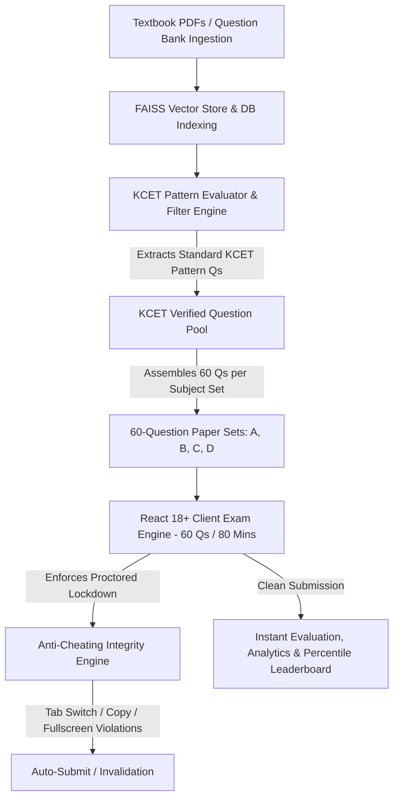

# 📄 Product Requirements Document (PRD)
## SmartKCET Prep / ExamForge AI — Official KCET Question Paper Generation Platform

**Document Status:** Approved & Active  
**Version:** 2.1.0  
**Target Audience:** Engineering & Development Team, Product Management, System Architects  
**Product Name:** SmartKCET Prep / ExamForge AI  
**Target Exam:** Karnataka Common Entrance Test (KCET) Exclusively  
**Frontend Framework:** React 18+ Single Page Application (SPA)  
**Backend Framework:** Flask (Python 3.10+) with Flask Blueprints  
**Last Updated:** August 2026  

---

## 1. 🎯 Executive Summary & Problem Statement

### 1.1 Executive Summary
SmartKCET Prep / ExamForge AI is a specialized, AI-driven exam preparation and question paper extraction platform designed **exclusively for the Karnataka Common Entrance Test (KCET)**. The platform ingests textbook content and question banks, applies an automated KCET Pattern Filter to extract standard KCET-level questions, and generates official-format exam paper sets containing **exactly 60 questions per set** (matching the official KCET 60-question/60-mark 80-minute paper structure).

The system features an integrated **Anti-Cheating & Exam Integrity Engine** and combines a modern **React 18+ Single Page Application (SPA)** frontend (built with **Vite**, **TypeScript/JavaScript**, **React Router v6**, and **Tailwind CSS**) with a robust **Flask (Python 3.10+)** REST API backend utilizing **Flask Blueprints**, **Flask-SQLAlchemy**, **RAG Retrieval**, **Groq LLMs**, and **FAISS Vector Search**.

### 1.2 Problem Statement
* **Non-Standard Question Counts & Patterns:** Existing online mock platforms present arbitrary question lengths (20, 50, or 100 questions) rather than adhering strictly to the official KCET 60-question format.
* **Unfiltered Question Banks:** Raw question banks contain out-of-syllabus, overly simple, or JEE-Advanced level questions that do not reflect actual KCET difficulty or chapter weightage.
* **Exam Malpractice & Cheating Vulnerabilities:** Online mock tests without proctoring suffer from tab-switching, copy-pasting, unauthorized search usage, and answer sharing among students.

---

## 2. 🚀 Product Vision & Core Workflow

### 2.1 Product Vision
To provide KCET aspirants and coaching institutions with an authentic, secure, automated exam platform that extracts standard KCET-pattern questions from indexed textbook banks and generates production-ready **60-question exam sets** with strict anti-cheating enforcement and instant analytics.

### 2.2 End-to-End Question Extraction & Exam Integrity Workflow



---

## 3. 👥 User Personas & Roles

| Persona / Role | Description & Needs | Primary Workflows |
| :--- | :--- | :--- |
| **KCET Student Aspirant** | High school student preparing specifically for KCET. | Takes 60-question proctored KCET timed subject papers, reviews step-by-step solutions, tracks KCET rank. |
| **Coaching Institute Admin** | Instructor/Director monitoring online exams. | Reviews student violation logs (tab switches, full-screen exits), assigns 60-question papers, views class analytics. |
| **Platform Administrator** | Platform owner managing system health and exam integrity policies. | Configures anti-cheating thresholds, triggers KCET paper extractions, manages pricing plans. |

---

## 4. ⚙️ Functional Requirements (FRs)

### FR-1: KCET Question Extraction & Pattern Filtering Engine
* **FR-1.1 Question Bank Storage:** System stores ingested textbook chunks and candidate questions in the database with subject and topic tagging.
* **FR-1.2 KCET Pattern Rules & Extraction:**
  - **Single Mark Standard:** Every extracted question carries exactly **1 mark** (no negative marking, matching official KCET rules).
  - **Difficulty Standard:** Standard entrance-level MCQs (application, multi-step numericals, conceptual deductions).
  - **Numerical Calculation Ratio:** At least 60% of Physics & Physical Chemistry questions must be multi-step numerical calculation problems.
  - **Topic Alignment:** Questions strictly align with prescribed 1st & 2nd PUC KCET syllabus.
  - **Distractor Quality:** 4 options (A, B, C, D) with plausible distractors.

### FR-2: 60-Question Paper Set Generation (`/api/admin/exams/extract-kcet-set`)
* **FR-2.1 Exact Set Count:** Each generated subject exam paper set MUST contain **EXACTLY 60 questions**.
* **FR-2.2 Multi-Set Generation:** Generates 4 distinct paper sets (**Set A, Set B, Set C, Set D**), each containing 60 questions.
* **FR-2.3 Option & Question Randomization:** Options (A, B, C, D) and question order are dynamically shuffled per student candidate to prevent answer sharing.

### FR-3: Anti-Cheating & Exam Integrity System (`<AntiCheatingGuard />`)
* **FR-3.1 Tab Switch & Window Focus Detection:**
  - React hook listens to `visibilitychange`, `window.onblur`, and `window.onfocus` events.
  - Displays modal warnings on tab switches. On exceeding **3 tab-switch warnings**, the exam is automatically submitted immediately with a logged violation.
* **FR-3.2 Forced Full-Screen Enforcement:**
  - React client requires full-screen mode (`requestFullscreen()`) before initializing the 60-question paper.
  - Exiting full-screen mode pauses the exam, logs a warning, and gives a 10-second grace timer to return to full-screen mode before auto-submitting.
* **FR-3.3 DOM & Keyboard Lockdown:**
  - Disables right-click context menu (`contextmenu`).
  - Disables text selection (`selectstart`), copy (`copy`), cut (`cut`), and paste (`paste`).
  - Blocks developer tools and view-source keyboard shortcuts (`F12`, `Ctrl+Shift+I`, `Ctrl+Shift+J`, `Ctrl+U`, `Ctrl+C`, `Ctrl+V`).
* **FR-3.4 Server-Enforced Time Window Verification:**
  - Backend records server timestamp on exam start (`started_at`).
  - Submissions beyond the official 80-minute window (+ 30-second network grace) are automatically flagged and strictly capped.
* **FR-3.5 Dual-Session & Single Device Binding:**
  - Active JWT session tokens prevent concurrent exam logins from multiple devices or browser windows under the same account.
* **FR-3.6 Violation Logging:**
  - System logs every integrity event (tab switch counts, full-screen exit timestamps, focus loss) to the candidate's exam attempt record (`exam_attempts.integrity_log`).

### FR-4: React SPA Frontend Architecture
* **FR-4.1 Stack:** Built with **React 18+**, **Vite**, **TypeScript/JavaScript**, **React Router v6**, and **Tailwind CSS**.
* **FR-4.2 60-Question Exam Component (`<KCETExamEngine />`):**
  - Displays interactive 60-question drawer grid (Numbered 1 to 60).
  - Official **80-minute countdown timer** with auto-submission on expiration.
  - Integrates `<AntiCheatingGuard />` for real-time focus and full-screen enforcement.

### FR-5: Flask Backend & Blueprint Architecture
* **FR-5.1 Application Factory:** Built with **Flask 3.x** / Python 3.10+ using modular blueprints:
  - `auth_bp` (`/api/auth`): Registration, login, JWT token issuance via **Flask-JWT-Extended**.
  - `admin_bp` (`/api/admin`): Question bank management, KCET pattern filtering, integrity log reviews.
  - `student_bp` (`/api/student`): Dashboard analytics, 60-question proctored exam execution, scoring.
  - `subscription_bp` (`/api/subscription`): Access control pre-exam gate (`/api/exam/check-access`).

### FR-6: Automated Instant Evaluation & Violation Scoring
* **FR-6.1 Instant Scoring:** Evaluates responses out of **60 marks**. If an attempt is auto-submitted due to anti-cheating violation, it calculates marks for answered questions up to the violation point and flags the attempt in student records.

---

## 5. 🛡️ Non-Functional Requirements (NFRs)

* **Integrity Detection Latency:** Tab switch and focus loss detected in `< 50ms`.
* **Paper Set Extraction Speed:** Extraction and assembly of 60 KCET questions completed in `< 10s`.
* **API Performance:** REST API response latency `< 200ms`.
* **Security:** HTTPS/TLS, Flask-JWT-Extended authentication, CORS policy restricted to React domain, DOM event prevention.
* **WSGI Deployment:** Production backend hosted via **Gunicorn** / **Waitress**.

---

## 6. 🏗️ Architecture & Technology Stack

```text
+-----------------------------------------------------------------------+
|                    REACT 18+ SPA FRONTEND (Vite)                      |
|  React Router v6 | Tailwind CSS | Axios | Recharts | Lucide Icons    |
|  [Components: KCETExamEngine, AntiCheatingGuard, StudentDashboard]    |
+-----------------------------------------------------------------------+
                                   |
           REST API (JSON / JWT Headers / Integrity Flags)
                                   v
+-----------------------------------------------------------------------+
|                            FLASK BACKEND                              |
|  +-------------------+  +-------------------+  +------------------+   |
|  | Auth Blueprint    |  | Admin Blueprint   |  | Student Blueprint|   |
|  | /api/auth         |  | /api/admin        |  | /api/student     |   |
|  +-------------------+  +-------------------+  +------------------+   |
|                                                                       |
|  +-----------------------------------------------------------------+  |
|  |       KCET PATTERN EVALUATION & ANTI-CHEATING AUDIT ENGINE      |  |
|  |  PyMuPDF + Groq Vision OCR + FAISS Index + Violation Auditor    |  |
|  +-----------------------------------------------------------------+  |
+-----------------------------------------------------------------------+
                                   |
                          Flask-SQLAlchemy ORM
                                   v
+-----------------------------------------------------------------------+
|                      SQLite / PostgreSQL Database                      |
|      [QuestionBank, KCETPaperSets, ExamAttempts, IntegrityLogs]       |
+-----------------------------------------------------------------------+
```

---

## 7. 🔌 API Specifications Summary

| Method | Endpoint | Blueprint | Description |
| :--- | :--- | :--- | :--- |
| `POST` | `/api/auth/login` | `auth_bp` | Authenticates user and returns JWT token |
| `POST` | `/api/admin/exams/extract-kcet-set` | `admin_bp` | Filters question bank & extracts 60 KCET Qs for Sets A/B/C/D |
| `GET` | `/api/student/exams/{id}/paper` | `student_bp` | Fetches active 60-question KCET paper set for student |
| `POST` | `/api/student/exams/{id}/log-violation`| `student_bp` | Logs anti-cheating integrity violation (tab switch, fullscreen exit) |
| `POST` | `/api/student/exams/{id}/submit` | `student_bp` | Submits 60 responses for evaluation (Max score: 60) |
| `GET` | `/api/student/dashboard` | `student_bp` | Retrieves KCET score analytics, violation history, and attempts |

---

## 8. 🗺️ Future Roadmap

* **AI Webcam Face Proctoring:** Periodic background camera check via HTML5 MediaDevices API for single-candidate verification.
* **Official KCET OMR Sheet Mode:** Printable PDF OMR sheet exporter and bubble-sheet scanner integration.
* **Adaptive KCET Rank Predictor:** Predicts estimated KCET engineering/medical rank based on 60-mark paper scores.
