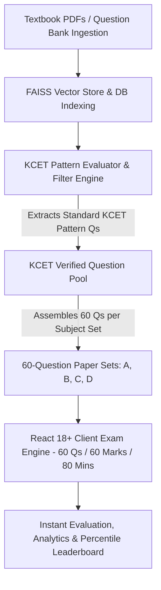

# 📄 Product Requirements Document (PRD)
## SmartKCET Prep / ExamForge AI — Official KCET Question Paper Generation Platform

**Document Status:** Approved & Active  
**Version:** 2.0.0  
**Target Audience:** Engineering & Development Team, Product Management, System Architects  
**Product Name:** SmartKCET Prep / ExamForge AI  
**Target Exam:** Karnataka Common Entrance Test (KCET) Exclusively  
**Frontend Framework:** React 18+ Single Page Application (SPA)  
**Backend Framework:** Flask (Python 3.10+) with Flask Blueprints  
**Last Updated:** August 2026  

---

## 1. 🎯 Executive Summary & Problem Statement

### 1.1 Executive Summary
SmartKCET Prep / ExamForge AI is a specialized, AI-driven exam preparation and question paper extraction platform designed **exclusively for the Karnataka Common Entrance Test (KCET)**. The platform ingests textbook content and question banks, applies an automated KCET Pattern Filter to extract standard KCET-level questions, and generates official-format exam paper sets containing **exactly 60 questions per set** (matching the official KCET 60-question/60-mark 80-minute paper structure).

The system integrates a modern **React 18+ Single Page Application (SPA)** frontend (built with **Vite**, **TypeScript/JavaScript**, **React Router v6**, and **Tailwind CSS**) with a robust **Flask (Python 3.10+)** REST API backend utilizing **Flask Blueprints**, **Flask-SQLAlchemy**, **RAG Retrieval**, **Groq LLMs**, and **FAISS Vector Search**.

### 1.2 Problem Statement
* **Non-Standard Question Counts & Patterns:** Existing online mock platforms present arbitrary question lengths (20, 50, or 100 questions) rather than adhering strictly to the official KCET 60-question format.
* **Unfiltered Question Banks:** Raw question banks contain out-of-syllabus, overly simple, or JEE-Advanced level questions that do not reflect actual KCET difficulty or chapter weightage.
* **Lack of Real KCET Simulation:** Students need timed practice that perfectly simulates the 60-question, 60-mark, 80-minute KCET subject paper environment.

---

## 2. 🚀 Product Vision & Core Workflow

### 2.1 Product Vision
To provide KCET aspirants and coaching institutions with an authentic, automated exam platform that extracts standard KCET-pattern questions from indexed textbook banks and generates production-ready **60-question exam sets** with instant evaluation and analytics.

### 2.2 End-to-End Question Extraction & Exam Generation Workflow



1. **Ingestion & Indexing:** Textbook PDFs and raw question banks are parsed and stored in the database and FAISS vector index.
2. **KCET Pattern Filtering:** An automated evaluator inspects stored questions and extracts ONLY standard KCET-compliant questions matching official syllabus weightage and KCET difficulty.
3. **60-Question Set Assembly:** The system selects exactly 60 verified KCET questions per subject paper set (Sets A, B, C, and D) without duplicate overlap.
4. **Interactive Exam Execution:** React client loads the 60-question set with an official 80-minute timer for practice.

---

## 3. 👥 User Personas & Roles

| Persona / Role | Description & Needs | Primary Workflows |
| :--- | :--- | :--- |
| **KCET Student Aspirant** | High school student preparing specifically for KCET (Physics, Chemistry, Math, Biology). | Takes 60-question KCET timed subject papers, reviews step-by-step solutions, tracks KCET rank progress. |
| **Coaching Institute Admin** | Instructor/Director at a KCET coaching center. | Assigns 60-question paper sets to student groups, views class accuracy analytics, seeds institution cohorts. |
| **Platform Administrator** | Platform owner managing system health and triggering KCET 60-question paper set extractions. | Monitors KCET question bank metrics, triggers paper extractions, manages pricing plans. |

---

## 4. ⚙️ Functional Requirements (FRs)

### FR-1: KCET Question Extraction & Pattern Filtering Engine
* **FR-1.1 Question Bank Storage:** System stores ingested textbook chunks and candidate questions in the database with subject and topic tagging.
* **FR-1.2 KCET Pattern Rules & Extraction:**
  - **Single Mark Standard:** Every extracted question must carry exactly **1 mark** (no negative marking, matching official KCET rules).
  - **Difficulty Standard:** Questions must be standard entrance-level MCQs (application, multi-step numericals, conceptual deductions). Excludes trivial definitions.
  - **Numerical Calculation Ratio:** At least 60% of Physics & Physical Chemistry questions must be multi-step numerical calculation problems.
  - **Topic Alignment:** Questions must strictly align with the prescribed 1st & 2nd PUC KCET syllabus.
  - **Distractor Quality:** 4 options (A, B, C, D) with plausible distractors representing common student calculation errors.
  - **Exclusion Filter:** Excludes figure references ("as shown in fig"), brand names, and meta-references ("according to passage").

### FR-2: 60-Question Paper Set Generation (`/api/admin/exams/generate-kcet-set`)
* **FR-2.1 Exact Set Count:** Each generated subject exam paper set MUST contain **EXACTLY 60 questions** — no more, no less.
* **FR-2.2 Multi-Set Generation:** Generates 4 distinct paper sets (**Set A, Set B, Set C, Set D**), each containing 60 questions.
* **FR-2.3 Duplicate Prevention:** Questions used in Set A are excluded from Sets B, C, and D within the same exam cycle.

### FR-3: React SPA Frontend Architecture
* **FR-3.1 Stack:** Built with **React 18+**, **Vite**, **TypeScript/JavaScript**, **React Router v6**, and **Tailwind CSS**.
* **FR-3.2 State & Axios Client:** Centralized `AuthContext` for JWT authentication; Axios client handles requests to the Flask backend.
* **FR-3.3 60-Question Exam Component (`<KCETExamEngine />`):**
  - Displays interactive 60-question drawer grid (Numbered 1 to 60).
  - Official **80-minute countdown timer** with auto-submission on expiration.
  - Option selector (A, B, C, D), question flagging, and answer status tracking (Answered, Unanswered, Flagged).

### FR-4: Flask Backend & Blueprint Architecture
* **FR-4.1 Application Factory:** Built with **Flask 3.x** / Python 3.10+ using modular blueprints:
  - `auth_bp` (`/api/auth`): Registration, login, JWT token issuance via **Flask-JWT-Extended**.
  - `admin_bp` (`/api/admin`): Question bank management, KCET pattern filtering, 60-question set extraction.
  - `student_bp` (`/api/student`): Dashboard analytics, 60-question exam execution, instant scoring, rank leaderboard.
  - `subscription_bp` (`/api/subscription`): Pricing plans, access control pre-exam gate (`/api/exam/check-access`).
  - `institution_bp` (`/api/institution`): Bulk student enrollment and license allocation.
* **FR-4.2 Database Layer:** **Flask-SQLAlchemy** (SQLAlchemy 2.0 ORM) with **Flask-Migrate**.

### FR-5: Automated Instant Evaluation & Analytics
* **FR-5.1 Instant Scoring:** Upon submitting the 60-question paper, backend immediately evaluates responses out of **60 marks**.
* **FR-5.2 Analytics Breakdown:** Reports total score, accuracy %, correct/incorrect/unattempted breakdown, subject/chapter accuracy, and time spent per question.
* **FR-5.3 Leaderboard:** Ranks students based on their 60-mark KCET score performance.

---

## 5. 🛡️ Non-Functional Requirements (NFRs)

* **Paper Set Extraction Speed:** Extraction and assembly of 60 KCET questions completed in `< 10s`.
* **API Performance:** REST API response latency `< 200ms`.
* **Exam Engine Smoothness:** React client 60-question navigation grid updates seamlessly with `< 16ms` UI render delay.
* **Security:** HTTPS/TLS, Flask-JWT-Extended authentication, CORS policy restricted to React domain.
* **WSGI Deployment:** Production backend hosted via **Gunicorn** / **Waitress**.

---

## 6. 🏗️ Architecture & Technology Stack

```text
+-----------------------------------------------------------------------+
|                    REACT 18+ SPA FRONTEND (Vite)                      |
|  React Router v6 | Tailwind CSS | Axios | Recharts | Lucide Icons    |
|  [Components: KCETExamEngine (60 Qs/80 Mins), StudentDashboard]       |
+-----------------------------------------------------------------------+
                                   |
                     REST API (JSON / JWT Headers)
                                   v
+-----------------------------------------------------------------------+
|                            FLASK BACKEND                              |
|  +-------------------+  +-------------------+  +------------------+   |
|  | Auth Blueprint    |  | Admin Blueprint   |  | Student Blueprint|   |
|  | /api/auth         |  | /api/admin        |  | /api/student     |   |
|  +-------------------+  +-------------------+  +------------------+   |
|                                                                       |
|  +-----------------------------------------------------------------+  |
|  |             KCET PATTERN EVALUATION & FILTER ENGINE             |  |
|  |  PyMuPDF + Groq Vision OCR + FAISS Index -> 60 Qs Extraction    |  |
|  +-----------------------------------------------------------------+  |
+-----------------------------------------------------------------------+
                                   |
                          Flask-SQLAlchemy ORM
                                   v
+-----------------------------------------------------------------------+
|                      SQLite / PostgreSQL Database                      |
|            [QuestionBank, KCETPaperSets (60 Qs), Attempts]            |
+-----------------------------------------------------------------------+
```

---

## 7. 🔌 API Specifications Summary

| Method | Endpoint | Blueprint | Description |
| :--- | :--- | :--- | :--- |
| `POST` | `/api/auth/login` | `auth_bp` | Authenticates user and returns JWT token |
| `POST` | `/api/auth/register` | `auth_bp` | Registers a new student account |
| `GET` | `/api/admin/platform/students` | `admin_bp` | Fetches list of all platform students |
| `POST` | `/api/admin/exams/extract-kcet-set` | `admin_bp` | Filters question bank & extracts 60 KCET Qs for Sets A/B/C/D |
| `GET` | `/api/student/exams/{id}/paper` | `student_bp` | Fetches active 60-question KCET paper set for student |
| `POST` | `/api/student/exams/{id}/submit` | `student_bp` | Submits 60 responses for evaluation (Max score: 60) |
| `GET` | `/api/student/dashboard` | `student_bp` | Retrieves KCET score analytics and attempt history |

---

## 8. 🗺️ Future Roadmap

* **Official KCET OMR Sheet Mode:** Printable PDF OMR sheet exporter and bubble-sheet scanner integration.
* **Chapter-Wise 60-Question Practice:** Custom 60-question chapter mock tests for targeted revision.
* **Adaptive KCET Rank Predictor:** Predicts estimated KCET engineering/medical rank based on 60-mark paper scores.
